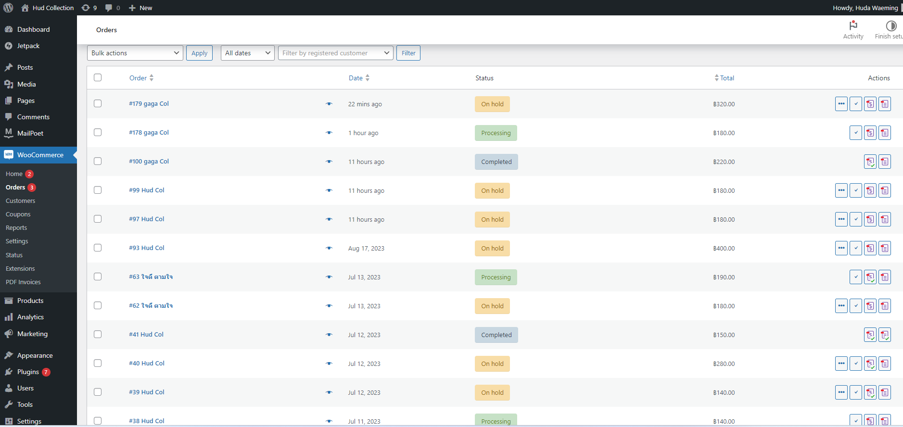

<<<<<<< Updated upstream
# Modern-Ecommerce-Platforms
Design and Develop Modern Ecommerce Plafform

I'm building a website to further my business, is a website about online sales I use wordpress to build my website because it is easy to use and offers new functions according to my needs.
The main website creation steps are as follows.

### Design E-Commerce BPMN 
The first step is to design the entire functional framework of the website and how it works, both internal and external systems By using BPMN to mainly have customers, system administrators, Employees for packing/delivery and deliver.

### Interface of website page
Pages of the Website According to the Structure that has been Designed.

**Customer**
- Browser Menu Page.

When customers visit the website, they will see this page as the home page, It will show the various products that we sell and will introduce the store.
.png)

- Search an Item Page.

It will only show results when we search for the desired product, If you see the product it means that we sell the product that he is looking to buy, But if you don't see it, you can search again and again.

- Add Item to Cart Page.

When you press Add to Cart, it will be displayed in the right corner with a basket icon and it will link to Manage Cart or Checkout when pressed.

- Manage Cart Page.

The Manage Cart page will display the details of the product list, The number of orders, the price, and the total amount automatically.

- Check Out Page.

When you press to order, the product will appear, fill in the address for delivery and contact.

- Payment Page.

=======
# HUD Collection By using Wordpress
Design and Develop Modern Ecommerce Platform

### Abstract 
My project involves taking a HUD Collection of pages on various platforms and turning them into a website in order to create a more efficient online store. This ecommerce extension is built on the popular WordPress content management system. It offers a powerful feature set tailored to the needs of online retailers with product support Payment channels and a variety of delivery options. It provides customers with a smooth and user-friendly shopping experience, The platform's flexibility allows businesses to create unique and branded online stores And an extensive plug-in ecosystem helps expand its capabilities. Whether you are a small boutique or a large enterprise, The WordPress ecommerce platform helps you manage your online business efficiently and drive sales.
### I.INTRODUCTION
WordPress is a computer program (Software) that helps you create and manage websites or blogs on the Internet easily and efficiently. It is commonly used to create websites and blogs, and there are many plugins and themes that can be added to customize a website according to the user's needs.

We therefore want to develop our online business to be more efficient and increase sales than ever before. Using WordPress and WooCommerce to help manage the eCommerce system more easily. and is attractive to customers who come to shop on our website In the following section We will provide information that will be used with the goal of making our website and systems easier to use for business owners and customers.
#### Software and Tools Used
**1.WordPress** serves as the main content management system (CMS) for our website. It offers a flexible and easy-to-use environment for managing web content.

**2.WooCommerce** it is a free WordPress website plugin that will help turn your website into a professional ecommerce store. it is an additional plugin in WordPress that makes creating and managing an online store easy. And it also has many useful features.

**3.Laragon** is an emulator that allows our machine to function as a Web Server, ideal for creating and managing modern web applications. Focus on efficiency Designed with stability in mind Simplicity, flexibility and freedom.

**4.Theme** a set of files that define the look and functionality of your website. Control the design, layout, and style of your website. With a variety of customizable themes You can easily change the look of your site.

**5.PDF Invoices & Packing Slips for WooCommerce** helps you create custom sales documents. It also allows you to add brand identity to your buyers' paper/paperless projects.

### II.LITERATURE REVIEW
For an introduction to the topic of WordPress and its importance in the world of web development and content management, read the Abstract or Introduction section above.
#### BPMN Diagram

    

The first step is to design the entire functional framework of the website and how it works, both internal and external systems By using BPMN to mainly have customers, system administrators, Employees for packing/delivery and deliver.

* **Customer**

Activities of customers on our website.

    

- Start with the customer opening our website it will show **Browser Menu Page**.
- **Search an item** customers can search for the products they want on our website.

    

It will only show results when we search for the desired product, If you see the product it means that we sell the product that he is looking to buy, But if you don't see it, you can search again and again.

- Add Item to Cart Page.

  

When you press Add to Cart, it will be displayed in the right corner with a basket icon and it will link to Manage Cart or Checkout when pressed.

- Manage Cart Page.

  

The Manage Cart page will display the details of the product list, The number of orders, the price, and the total amount automatically.

- Check Out Page.

  

When you press to order, the product will appear, fill in the address for delivery and contact.

- Payment Page.

  

>>>>>>> Stashed changes
There are two payment methods to choose from is COD or transfer.
If transfer it will show the transfer details on Order received page.

**Once the order is complete, the information will be sent to the system administrator to check the product stock.**

**Admin**
- Check Slip & Confirm Order Page.
<<<<<<< Updated upstream

    If Stock Out, If the product is out of stock, the admin will send another email to the customer to let them know that it is out of stock Or interested in other products instead?.

    If In Stock, Admin will accept the order and send information to the packing staff again to prepare for delivery.

=======

  

If Stock Out, If the product is out of stock, the admin will send another email to the customer to let them know that it is out of stock Or interested in other products instead?.

If In Stock, Admin will accept the order and send information to the packing staff again to prepare for delivery.
>>>>>>> Stashed changes

**Clerk**
- Prepare Order For Shipping.
- Ship Order to Deliver, when shipping Order the packing staff will inform the parcel number to the customer for easy tracking of the parcel with Deliver.

<<<<<<< Updated upstream

- Review Order/Check Order Status Page.

**Deliver**
- Deliver Oreder to Customer.

# HAPPY ENDING ^^
=======

  

- Review Order/Check Order Status Page.

  

**Deliver**
- Deliver Oreder to Customer.

### III.METHODOLOGY
Using Agile in eCommerce allows you to deal effectively with changing market and customer needs. and help reduce the risk of eCommerce development to the greatest detail possible.

  

### IV.EXPERIMENTATION AND RESULT

### V.CONCLUSION
Ecommerce on WordPress is valuable and starting an online business or expanding one will offer you the guidance and continuity of an accessible online store and reach customers across the globe through. Internet simultaneously made easier
### REFERENCES
-https://chat.openai.com/c/2eccc2b3-fdb0-4328-87ee-de8ad72950bb.

-https://www.iplandigital.co.th/.

-https://woocommerce-pdf-invoices-packing-slips.softonic-th.com/wordpress.

-https://www.hostinger.com/tutorials/.
>>>>>>> Stashed changes
